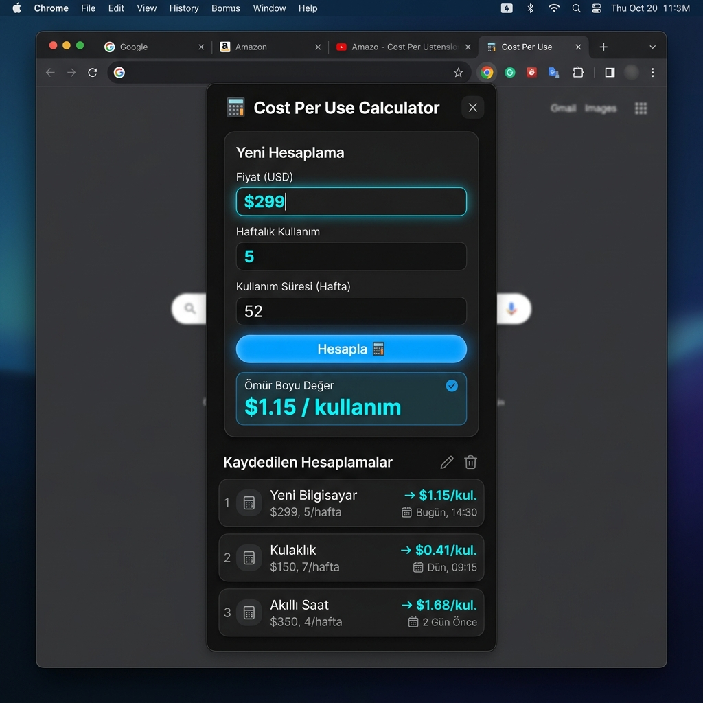
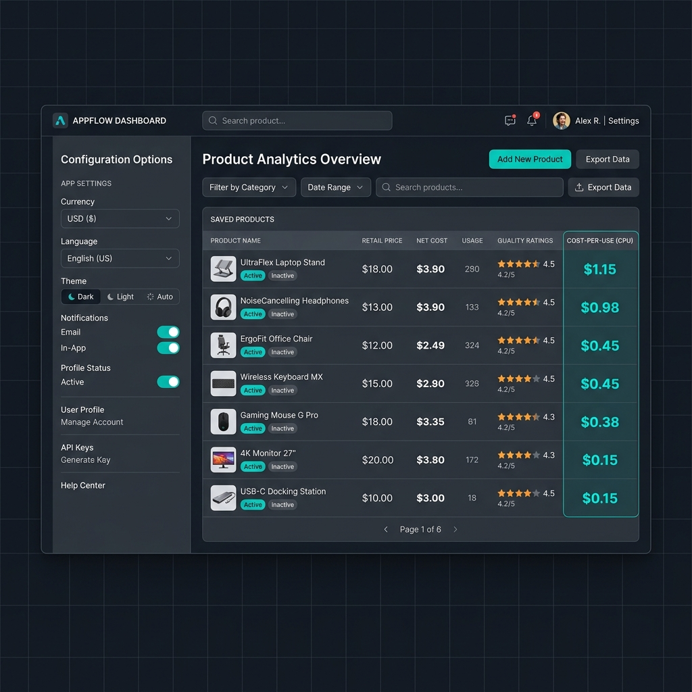

# Cost Per Use — Chrome Extension

> A premium, free, privacy-friendly shopping decision helper that users can open instantly before buying an expensive product.

**Cost Per Use** is a beautiful, privacy-first Chrome Extension that helps you calculate the real value of a purchase based on how frequently you expect to use it. Make smarter buying decisions, compare alternatives, and keep a history of your product assessments — completely locally.

---

## Screenshots

<p align="center">
  
  
</p>

---

## Key Features

1. **Cost-Per-Use Calculation** — Input the product price, ownership duration, and weekly usage to get the estimated cost per use.
2. **Advanced Adjustment (Net Cost)** — Factor in potential resale value, recurring maintenance costs, and installment plans.
3. **Smart Value Rating** — Visual badges: *Excellent*, *Good*, *Think Twice*, or *Expensive*.
4. **Product Comparison** — Contrast up to 3 products side-by-side.
5. **Auto-fill from Shopping Sites** — Automatically detects product name & price from Amazon, Trendyol, Hepsiburada, and eBay. Toggleable in settings.
6. **Multi-Currency** — USD, TRY, EUR, GBP, and custom currencies.
7. **Labor Time Equivalent** — See how many work hours each use costs.
8. **Local History** — Save, export, and import calculations as JSON.
9. **Dark / Light Theme** — System preference detection included.
10. **English & Turkish** — Full bilingual support.
11. **100% Private** — Zero analytics, zero cloud databases, no accounts, no trackers.

---

## Technology Stack

| Layer | Tech |
|---|---|
| Manifest | Manifest V3 |
| Frontend | React (TypeScript) + Vite |
| Styling | Tailwind CSS + PostCSS |
| State | Zustand |
| Storage | `chrome.storage.local` |
| Testing | Vitest |

---

## Installation

### From Source

```bash
git clone https://github.com/tahsinsoyak/cost-per-use-extension.git
cd cost-per-use-extension
npm install
npm run build
```

### Load in Chrome / Edge

1. Open `chrome://extensions/` (or `edge://extensions/`)
2. Enable **Developer mode**
3. Click **Load unpacked**
4. Select the `dist` folder
5. Pin **Cost Per Use** to your toolbar

---

## Privacy

**Cost Per Use** is local-first.

- **No Accounts** — No login, subscription, or payment.
- **No Analytics** — We do not track your shopping behaviors or website visits.
- **No Cloud Sync** — Your data never leaves your browser. All history is saved to `chrome.storage.local` and can be cleared instantly.

---

## Support

This extension is 100% free and open source. If you find it valuable, consider supporting development:

[](https://www.patreon.com/tahsinsoyak)

---

## License

MIT License — see [LICENSE](LICENSE) for details.

---

<p align="center">
  Made with care by <a href="https://github.com/tahsinsoyak">@tahsinsoyak</a>
</p>
