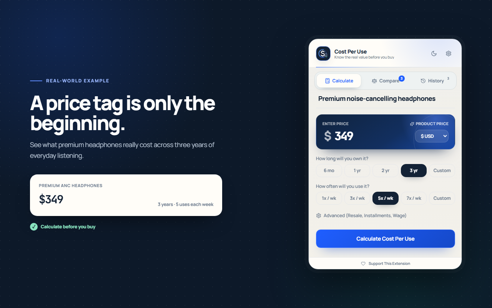
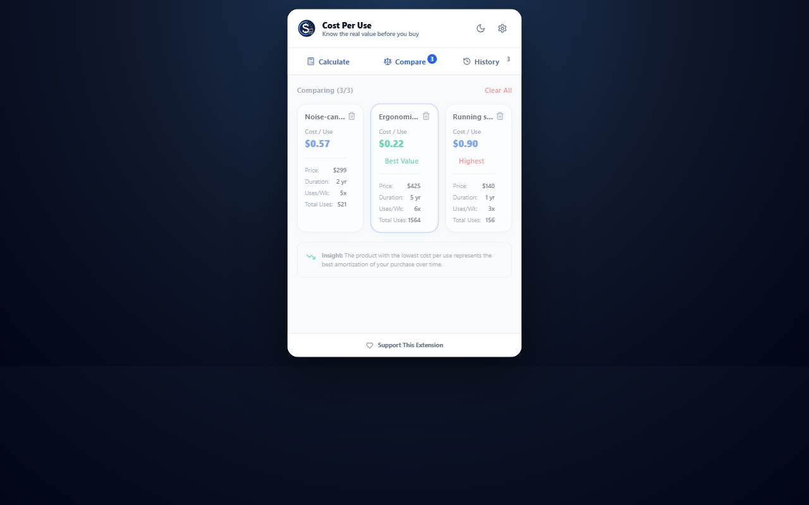

# Cost Per Use — Chrome Extension

> A premium, free, privacy-friendly shopping decision helper that users can open instantly before buying an expensive product.

**Cost Per Use** is a beautiful, privacy-first Chrome Extension that helps you calculate the real value of a purchase based on how frequently you expect to use it. Make smarter buying decisions, compare alternatives, and keep a history of your product assessments — completely locally.

---

## Screenshots

Version **1.1.0** is prepared for Chrome Web Store submission. See the [release notes](docs/releases/v1.1.0.md) and [upload guide](docs/chrome-web-store/releases/v1.1.0.md). Run `npm run release:check` to validate and package the extension.

Try the [public website](https://tahsinsoyak.github.io/cost-per-use-extension/). Website updates and Chrome Web Store updates are separate.

<p align="center">
  
</p>
<p align="center">
  
</p>

---

## Key Features

1. **Cost-Per-Use Calculation** — Input the product price, ownership duration, and weekly usage to get the estimated cost per use.
2. **Advanced Adjustment (Net Cost)** — Factor in potential resale value, recurring maintenance costs, and installment plans.
3. **Estimated Usage** — Neutral usage bands show expected total uses, without judging affordability.
4. **Product Comparison** — Contrast up to 3 products side-by-side.
5. **Auto-fill from Shopping Sites** — Automatically detects product name & price from Amazon, Trendyol, Hepsiburada, and eBay. Toggleable in settings.
6. **Multi-Currency** — USD, TRY, EUR, GBP, and custom currencies.
7. **Labor Time Equivalent** — See how many work hours each use costs.
8. **Local History** — Save, export, and import calculations as JSON.
9. **Dark / Light Theme** — System preference detection included.
10. **10 Languages** — English, Turkish, Spanish, German, French, Brazilian Portuguese, Russian, Arabic, Japanese, and Simplified Chinese, with English fallback for every message.
11. **100% Private** — Zero analytics, zero cloud databases, no accounts, no trackers.

---

## Usage scenarios

Every valid result compares your expected cost per use with half as much use over the same ownership period. Both scenarios keep the same net cost, including installment, maintenance, and resale adjustments. For example, $200 across 400 estimated uses is $0.50/use; half as much use is $1/use. Scenario estimates do not change your saved inputs.

[Preview the scenario card](docs/screenshots/usage-scenarios.png).

To check the scenario UI in all ten languages and both themes, run `node scripts/check_usage_scenarios.mjs`. It starts and stops its own preview server. This requires Playwright Chromium (`npx playwright install chromium`).

## Personal cost-per-use target

Enter an optional target below the usage scenarios to see the minimum whole uses needed. For example, a $200 net cost and a $0.50/use target require 400 uses. The card compares that count with your estimated usage, using the same resale, maintenance, and installment adjustments.

The target is a temporary planning input for the displayed calculation. It resets when you calculate again or leave the calculator, and is not added to saved history. Targets must be greater than zero. A zero net cost reaches any positive target on the first use.

[Preview the target card](docs/screenshots/cost-target-en.png).

Run `node scripts/check_cost_targets.mjs` to check targets in all ten languages and both themes. It starts and stops its own local preview server and requires Playwright Chromium (`npx playwright install chromium`).

## Technology Stack

| Layer | Tech |
|---|---|
| Manifest | Manifest V3 |
| Frontend | React (TypeScript) + Vite |
| Styling | Tailwind CSS + PostCSS |
| State | Zustand |
| Storage | `chrome.storage.local` |
| Testing | Vitest |

---

## Installation

### From Source

```bash
git clone https://github.com/tahsinsoyak/cost-per-use-extension.git
cd cost-per-use-extension
npm install
npm run build
```

### Load in Chrome / Edge

1. Open `chrome://extensions/` (or `edge://extensions/`)
2. Enable **Developer mode**
3. Click **Load unpacked**
4. Select the `dist` folder
5. Pin **Cost Per Use** to your toolbar

---

## Privacy

**Cost Per Use** is local-first.

- **No Accounts** — No login, subscription, or payment.
- **No Analytics** — We do not track your shopping behaviors or website visits.
- **No Cloud Sync** — Your data never leaves your browser. All history is saved to `chrome.storage.local` and can be cleared instantly.

Read the full [Privacy Policy](docs/privacy-policy.md). Chrome Web Store submission materials are in [docs/chrome-web-store](docs/chrome-web-store/README.md).

Release history is available in the [changelog](CHANGELOG.md).

---

## Support

This extension is 100% free and open source. If you find it valuable, consider supporting development:

[](https://www.patreon.com/tahsinsoyak)

---

## License

MIT License — see [LICENSE](LICENSE) for details.

---

<p align="center">
  Made with care by <a href="https://github.com/tahsinsoyak">@tahsinsoyak</a>
</p>
